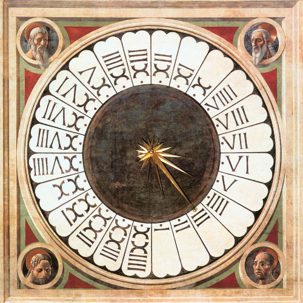
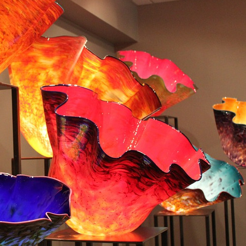

```{r, child="_logo.Rmd"}
```

```
  __  __         _    _    _                       ____         _                  _
 |  \/  |  __ _ | |_ | |_ | |__    ___ __      __ |  _ \  ___  | |__    ___  _ __ | |_  ___   ___   _ __
 | |\/| | / _` || __|| __|| '_ \  / _ \\ \ /\ / / | |_) |/ _ \ | '_ \  / _ \| '__|| __|/ __| / _ \ | '_ \
 | |  | || (_| || |_ | |_ | | | ||  __/ \ V  V /  |  _ <| (_) || |_) ||  __/| |   | |_ \__ \| (_) || | | |
 |_|  |_| \__,_| \__| \__||_| |_| \___|  \_/\_/   |_| \_\\___/ |_.__/  \___||_|    \__||___/ \___/ |_| |_|
```

# This is a portfolio of image manipulation techniques presented in CST 205
&nbsp;
&nbsp;

## Rose Colored Glasses (Lab 3)
This function modifies a picture making it more pink tinted.

It works by traversing each pixel in the image and recoloring the pixel component colors as follows:

- 75% red
- 50% green
- 50% blue

| before                           | after |
:-------------------------------:|:-------------------------------:
|  |  |

&nbsp;

## Negative
This function modifies a picture producing a negative of that image.

It works by traversing each pixel in the image and inverting each of its component colors.

| before                           | after |
:-------------------------------:|:-------------------------------:
|    |  |

&nbsp;

## Better Black and White
This function modifies a picture producing a black and white version of that image.

It works by traversing each pixel in the image and setting every color component for that pixel to the value corresponding to the following formula:

- 29.9% red
- 11.4% blue
- 58.7% green

| before                           | after |
:-------------------------------:|:-------------------------------:
|    |  |

&nbsp;

## Bottom to Top Mirror
This function modifies a picture producing a mirrored image of the bottom half placed on the top half

It works by traversing each pixel in the bottom half of the image and setting the corresponding top pixel's color to match it

| before                           | after |
:-------------------------------:|:-------------------------------:
|    |  |

&nbsp;

## Shrink
This function creates a new picture with half the original picture's width and height

It works by measuring the original's width and height, then creating a blank image with half those dimensions.
From there, pixels are copied from the original picture to the new one from every other row and column in the original.

| before                           | after |
:-------------------------------:|:-------------------------------:|
|:    |:  |

&nbsp;

## Collage
This function creates a new picture and utilizes several other functions to make a mashup of other pictures

It works by calling other functions and placing the returned contents on a 'canvas' picture

The difficulty in creating this function was maintaining a measure of covered area in the picture to ensure the entire canvas was consumed.

| collage |
|:---:|
|  |

&nbsp;

## Red Eye Reduction
This function modifies a picture producing a reduced red-eye effect from camera flash

It works by traversing each pixel in and measuring how close to the red color it is. If the pixel's color is close to red it brings the green value up to match it.

It was difficult to find a threshold value that would not ruin the rest of the image


| before                           | after |
:-------------------------------:|:-------------------------------:
|    |  |

&nbsp;

## Art-i-fy
This function modifies a picture producing a a posterized (color density reduction) effect.

It works by taking the values for each pixel's color components and
 bucketing them into groups of single values.
For example, if the red is in the range 63 to 128, the value would be set to 95.

| before                           | after |
:-------------------------------:|:-------------------------------:
|    |  |

&nbsp;

## Chroma Key
This function takes two pictures an merges them by taking the colors
 from the foreground image that match the specified color (green here)
  and replacing them with the background image.

It works by checking each pixel's color against the specified color.
If the color matches within the threshold, that color is replaced with
 the color in the corresponding pixel within the background image.

This was another case where finding the correct threshold can be difficult.

| source                           | target |
:-------------------------------:|:-------------------------------:
|    |  |

| merged |
|:---:|
|  |

&nbsp;

## Thanksgiving Card
This is another mashup function, similar to the collage one.
This time it creates a fancy Thanksgiving day card.

It works by using functions to merge images, as well as functions that write text to the image.

One difficulty with completing this function is being able to precisely position text in the image.
My team created a custom function that makes an perfectly sized image from a text so that placement is simple.

| thanksgiving card |
|:---:|
|  |


&nbsp;

## Line Drawing
This line drawing function takes an image and modifies it to be a black & white image
 based on comparative luminosity with surrounding pixels.

It works by checks each pixel's luminosity with the ones below it and to its right.
 If the luminosity is within the threshold, the pixel is changed to black, otherwise it is white.

One challenge with this function was that I see the bottom and border sides do not have the filter applied.
Since the instructions did not say they should be, I left it alone.


| before                           | after |
:-------------------------------:|:-------------------------------:
|    |  |


&nbsp;